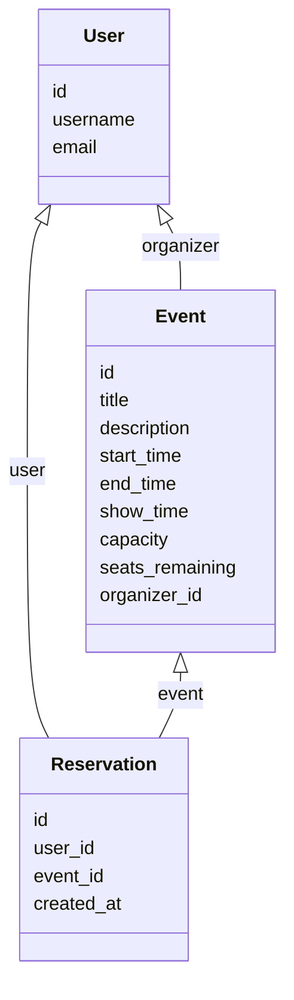

# Event-Management-Backend

A Django REST API for creating and booking events with concurrency-safe reservations.

---

## 1. Model Schema

### Models

- **User** (Django default `auth.User`)
- **Event**
  - `id`: AutoField
  - `title`: CharField
  - `description`: TextField
  - `start_time`: DateTimeField
  - `end_time`: DateTimeField
  - `capacity`: IntegerField
  - `seats_remaining`: IntegerField
  - `organizer`: ForeignKey(User)
- **Reservation**
  - `id`: AutoField
  - `user`: ForeignKey(User)
  - `event`: ForeignKey(Event)
  - `created_at`: DateTimeField

### Diagram (Mermaid)


## 2. API Endpoints
HTTP Method	URL	Description	Auth Required
POST	/api/signup/	Create a new user account	No
POST	/api/login/	Obtain authentication token	No
GET	/api/events/	List all events	Yes
POST	/api/events/	Create a new event	Yes
GET	/api/events/{id}/	Retrieve event details	Yes
PUT/PATCH	/api/events/{id}/	Update an event (organizer only)	Yes
DELETE	/api/events/{id}/	Delete an event (organizer only)	Yes
GET	/api/events/{id}/reservations/	View reservations for an event (organizer only)	Yes
GET	/api/reservations/	List user reservations	Yes
POST	/api/reservations/	Create reservation for an event	Yes
DELETE	/api/reservations/{id}/	Cancel a reservation	Yes

## 3. Setup Instructions
### Docker
**Requirements**
- Docker
- Docker Compose

Steps
1. Clone repository:
```
git clone git@github.com:rishiqwerty/event-management-backend.git
cd event-management-backend/eventmanagement/
```
2. Build and run containers:
docker compose up --build

3. Run Migrations
docker compose run web python manage.py migrate

4. Create Superuser For admin panel:
docker compose run web python manage.py createsuperuser

5. Running Tests
To run test make sure we are in project folder, where manage.py file is present
```
pytest
```
Note:
Concurrency Test for reservation will only pass when we are using postgresql

### Local Development
**Requirements**
- Python3.13
- direnv

**Steps**
1. Clone repository:
```
git clone git@github.com:rishiqwerty/event-management-backend.git
cd event-management-backend/eventmanagement/
```
2. Build environment using direnv:
```
direnv allow
```
3. Now install poetry.
```
pip install poetry
```
4. Install all the porject required packages:
```
poetry install
```

5. Run Migrations
```
python manage.py migrate
```

6. Create Superuser For admin panel:
```
python manage.py createsuperuser
```

5. Running Tests
To run test make sure we are in project folder, where manage.py file is present
```
pytest
```
Note:
Concurrency Test for reservation will only pass when we are using postgresql


## 4. Design Choices
**i. Data Modelling**
- **User**:
  Based on Django’s built-in `User` model.
  - A user can act as an **organizer** (create/manage events) or as an **attendee** (reserve events).
  - The relationship enables filtering events by organizer and associating reservations to the loggedin user.

- **Event**:
  Stores event details.
  - Linked to an **organizer (User)**.
  - `capacity` defines the maximum allowed participants.
  - `seats_remaining` is updated atomically during bookings/cancellations.

- **Reservation**:
  Explicit join model between **User** and **Event**.
  - Stores who reserved which event.
  - Enforces uniqueness via `unique_together (user, event)` to prevent duplicate bookings.
  - Handles business logic like decrementing available seats when created and restoring them when canceled.

**ii. Concurrency Handling**
- **Atomic Transactions**:
  Reservation creation is wrapped in a `transaction.atomic()` block. This ensures that seat decrement and reservation creation happen as a single unit.

- **Optimistic Locking via Database Constraint**:
  Seat availability is updated at the database level:
  ```
  Event.objects.filter(
      pk=event.pk,
      seats_remaining__gt=0
  ).update(seats_remaining=F('seats_remaining') - 1)
  ```

## 5. Swagger API Documentation
Swagger docs will be available at:
```
http://localhost:8000/docs/swagger/
```
While Authorizing in Docs make sure to provide 'Token <value>' as token for authentication
### API Endpoints

| HTTP Method | URL                                          | Authentication Required | Description                                                                  |
|-------------|----------------------------------------------|--------------------------|-----------------------------------------------------------------------------|
| **POST**    | `/api/authentication/signup/`                | No                       | Register a new user                                                         |
| **POST**    | `/api/authentication/login/`                 | No                       | Obtain an authentication token (TokenAuth)                                  |
| **GET**     | `/api/events/`                               | No                       | List all available events                                                   |
| **POST**    | `/api/event/events/`                         | Yes                      | Create a new event                                                          |
| **GET**     | `/api/event/events/{id}/`                    | No                       | Retrieve event details                                                      |
| **PUT**     | `/api/event/events/{id}/`                    | Yes (Organizer only)     | Update event details                                                        |
| **PATCH**   | `/api/event/events/{id}/`                    | Yes (Organizer only)     | Partially update event details                                              |
| **DELETE**  | `/api/event/events/{id}/`                    | Yes (Organizer only)     | Delete an event                                                             |
| **GET**     | `/api/event/events/{id}/total-reservations/` | Yes (Organizer only)     | View all reservations for an event                                          |
| **GET**     | `/api/reservation/reservations/`             | Yes                      | List all reservations for the logged-in user                                |
| **POST**    | `/api/reservation/reservations/`             | Yes                      | Create a reservation for an event                                           |
| **GET**     | `/api/reservation/reservations/{id}/`        | Yes (Owner only)         | Retrieve details of a specific reservation                                  |
| **DELETE**  | `/api/reservation/reservations/{id}/`        | Yes (Owner only)         | Cancel a reservation (increments available seats back)                      |
