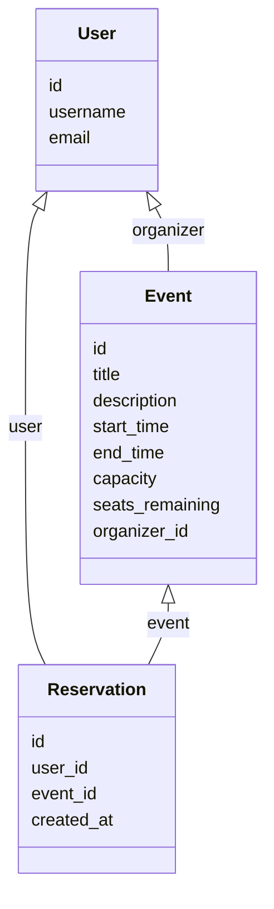

# Event-Management-Backend

A Django REST API for creating and booking events with concurrency-safe reservations.

---

## 1. Model Schema

### Models

- **User** (Django default `auth.User`)
- **Event**
  - `id`: AutoField
  - `title`: CharField
  - `description`: TextField
  - `start_time`: DateTimeField
  - `end_time`: DateTimeField
  - `capacity`: IntegerField
  - `seats_remaining`: IntegerField
  - `organizer`: ForeignKey(User)
- **Reservation**
  - `id`: AutoField
  - `user`: ForeignKey(User)
  - `event`: ForeignKey(Event)
  - `created_at`: DateTimeField

### Diagram (Mermaid)


## 2. API Endpoints
HTTP Method	URL	Description	Auth Required
POST	/api/signup/	Create a new user account	No
POST	/api/login/	Obtain authentication token	No
GET	/api/events/	List all events	Yes
POST	/api/events/	Create a new event	Yes
GET	/api/events/{id}/	Retrieve event details	Yes
PUT/PATCH	/api/events/{id}/	Update an event (organizer only)	Yes
DELETE	/api/events/{id}/	Delete an event (organizer only)	Yes
GET	/api/events/{id}/reservations/	View reservations for an event (organizer only)	Yes
GET	/api/reservations/	List user reservations	Yes
POST	/api/reservations/	Create reservation for an event	Yes
DELETE	/api/reservations/{id}/	Cancel a reservation	Yes

## 3. Setup Instructions
Requirements
- Docker
- Docker Compose

Steps
1. Clone repository:
```
git clone git@github.com:rishiqwerty/event-management-backend.git
cd event-management-backend/eventmanagement/
```
2. Build and run containers:
docker compose up --build

3. Run Migrations
docker compose run web python manage.py migrate

4. Create Superuser For admin panel:
docker compose run web python manage.py createsuperuser

## 4. Design Choices
i. Data Modelling
**Event** stores capacity and seats remaining.
**Reservation** maps user to event.
**User** relationship allows filtering events per organizer.

ii. Concurrency Handling
```
updated = Event.objects.filter(pk=event.pk, seats_remaining__gt=0)\
            .update(seats_remaining=F('seats_remaining') - 1)

if updated == 0:
    raise serializers.ValidationError("No seats remaining")
```
This ensures atomic update of seats in a single query, preventing overbooking.

## 5. Swagger API Documentation
Swagger docs will be available at:
```
http://localhost:8000/docs/swagger/
```
